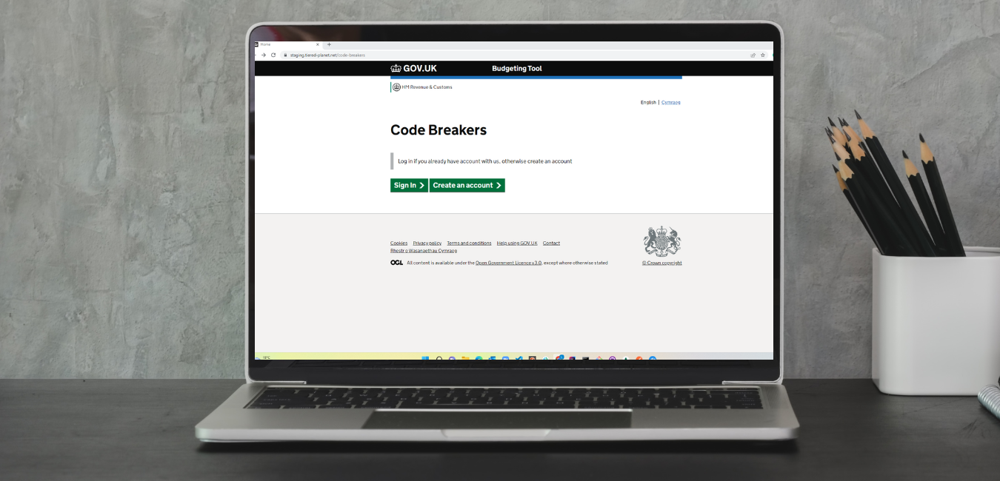

# HMRC <a href ="https://staging.tiered-planet.net/code-breakers" target="_blank">Code-Breakers</a> Salary Tax Calculator

This app allows the user to calculate their annual salary after tax and allows you to add you expediencies.

## Contributors 

* @Laura,
* @Lee,
* @Adil, 
* @German

## Design

### Frameworks
- PlayFramework - was used to build the web application with Scala
- HMRC.gov Framework - components were used to replicate the style and look of HMRC pages 

### Planning & Wireframes
Jira was used to create a Kanban board for creating and assigning issues for the project

Figma was used for the <a href="https://imgur.com/a/bOOCvcu" target="_blank">planning</a> of our application and for the <a href="https://imgur.com/a/EPPuTaL" target="_blank">wireframe</a>

-----
# Features

## Login 
- User can login to their account 
- User is shown an error if username doesn't match database
- User is shown an error if password doesn't match database
- After successful login user is directed to the Calculator page
## Register
- User can register their account
- User is shown warnings if form fields are incomplete
- After successful login user is directed to the Calculator page
## Salary Calculator
- User can calculate their take home salary after tax.

## Expense Form
- User can use the expense form to budget by deducting their annual expenses from their take home salary.

## Expense Table
- User can see all their expenses added in a table view.
-----
# Database Structure
**Mongodb** was used during development to store the following:
- Users - username, email, password
- Calculator - salary, tax code, pension, student loan
- Expenses - date, amount and category
-----
# Technologies Used

**Languages Used**
- <a href="https://www.scala-lang.org/" target="_blank">Scala</a>

**Libraries & Frameworks**
- <a href="https://design-system.service.gov.uk/get-started/" target="_blank">Gov.uk Design</a>
- <a href="https://www.playframework.com/" target="_blank">Play Framework</a>
- <a href="https://www.docker.com/" target="_blank">Docker</a>
- <a href="https://www.mongodb.com/" target="_blank">MongoDB</a>

-----
# Testing
Manual testing was carried out locally each feature was tested to ensure it was fully 

Local Testing was carried out for the following:

**Controllers**
- ExpenseControllerSpec
- RegisterControllerSpec
- HomeControllerSpec
- CalculatorControllerSpec

**Models**
- ExpenseSpec
- UserSpec
- StandardCalculatorSpec

**scala**
- NumberSpec
- StringSpec

**Services**
- StandardCalculatorServiceTest
- MongoExpenseServicesSpec

ScalaCheck & Scoverage were implemented

------

# Deployment
- <a href="https://www.jenkins.io/" target="_blank">Jenkins</a> was used for **CI** deployment
- <a href="https://spinnaker.io/" target="_blank">Spinnaker</a> was used for **CD** deployment

-----

# Future Development
- The ability to calculate your monthly or weekly salary
- A budgeting tool for Holidays, or any other big expenditure
- Add a Savings Goal, so user knows how much they need to save per month to reach their savings target
- Allow users the ability to add a new expense category
- Sort and Filter the expense table

# Credits
